# Análisis y comparación de protocolos para el control de flujo y congestión en redes utilizando simulación discreta

## Resumen
En este informe se analiza y compara un protocolo de control de flujo y congestión en redes de computadoras con el comportamiento de la red sin la utilización del protocolo, utilizando simulación discreta. El protocolo implementado por nosotros es un protocolo simple que llamaremos **"¡Pará la mano!"** y los resultados obtenidos muestran un buen desempeño, evitando la perdida de paquetes en los casos de prueba realizados.

## Introducción

### Control de flujo y congestión
El **control de flujo y congestión** en redes de computadoras son dos problemas que se presenta cuando se envían datos a través de una red compartida. Trabajaremos estos problemas desde el punto de vista de la capa de transporte del modelo OSI o TCP/IP.

El problema de **control de flujo** en la capa de transporte surge cuando un emisor envía datos a un receptor más rápido de lo que este puede procesarlos. El receptor debe informar al emisor que reduzca la velocidad de envío de datos ya que los datos que no puede procesar serán descartados y se perderá información.

El problema de **control de congestión** en la capa de transporte surge cuando un emisor envía datos a una red más rápido de lo que esta puede transmitirlos. La red debe informar al emisor que reduzca la velocidad de envío de datos ya que los datos que no puede transmitir serán descartados y se perderá información.

### Metodología de trabajo
Para analizar y comparar el protocolo de control de flujo y congestión con el comportamiento de la red sin la utilización del protocolo, utilizaremos **simulación discreta**.

La **simulación discreta** es una técnica de modelado de sistemas dinámicos en la que el tiempo avanza en forma discreta. En este tipo de simulación, el tiempo se divide en intervalos de tiempo y el estado del sistema se actualiza al final de cada intervalo.

Las simulaciones se realizan en un ordenador mediante **Omnett++**, un entorno de **simulación de eventos discretos**, donde se modela el comportamiento de una red simplificada y se analiza el funcionamiento de la red con y sin el protocolo de control de flujo y congestión.

La ventaja de utilizar simulación discreta es que se puede simular el comportamiento de la red en un tiempo _mucho menor_ al que se tardaría en realizar pruebas en una red real, y se puede analizar el comportamiento de la red en situaciones que serían _muy difíciles_ de simular en una red real. Por esa razón este estilo de simulación es una herramienta muy útil para analizar el comportamiento de una red.

### Análisis de los problemas
Nosotros evaluaremos el problema de control de flujo y control de congestión mediante 2 casos de pruebas:

- **Caso 1:** Se envían paquetes desde un emisor a un receptor a través de una red con un buffer intermedio. El emisor envía paquetes a una velocidad mayor a la que el receptor puede procesarlos. Este caso es un problema de control de flujo.
- **Caso 2:** Se envían paquetes desde un emisor a un receptor a través de una red con un buffer intermedio. El emisor envía paquetes a una velocidad mayor a la que la red (en este caso el buffer intermedio) puede transmitirlos. Este caso es un problema de control de congestión.

A continuación se muestran una imagen extraida del libro "Redes de Computadoras" de Tanenbaum que representa los problemas de control de flujo y congestión de una manera más visual e intuitiva y ayuda a distinguir mejor las diferencias entre ambos problemas.

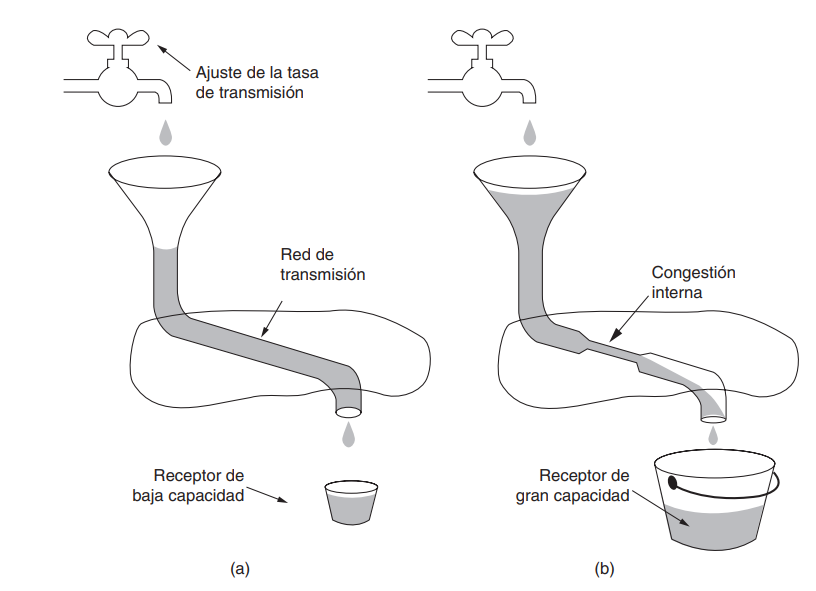

*(a) Una red veloz que alimenta a un receptor de baja capacidad. (b) Una red lenta que alimenta a un receptor de alta capacidad.*

La estructura que utilizaremos para evaluar el comportamiento de la red sin el protocolo es la siguiente:

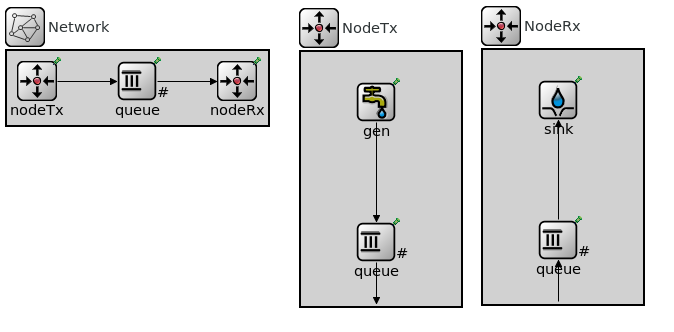

El funcionamiento de la red es muy básico, el generador crea paquetes que envia al queue de Tx, el cual esta conectado a otro queue intermedio, el cual le envia al queue Rx que esta conectado al recolector.

Para el caso 1 y caso 2 se modifican las tasas de transferencia de las conexiones entre colas, y los valores que se colocan dependen del caso de prueba que se quiera modelar.

La cola intermedia y la cola Rx tienen un tamaño de buffer de 200 paquetes, y la cola conectada con el generador tiene un tamaño de buffer de 2000000 paquetes. La razón de esto es que no nos interesa evaluar el comportamiento de la red cuando se llena el buffer del generador, ya que eso no es un problema de control de flujo o congestión, sino que es un problema interno/de configuración del generador.

El tamaño de los paquetes en todos los casos de prueba será de 12500 bytes, y el tiempo de simulación será de 200 segundos.

### Caso 1 - Problema de control de flujo

Para este caso se establecieron las siguientes tasas de transferencia:

- Entre la cola Rx y el recolector: 0.5Mbps
- Entre la cola Tx y la cola intermedia: 1Mbps
- Entre la cola intermedia y la cola Rx: 1Mbps

Esta claro que la cola Rx es el cuello de botella de la red, ya que es la que tiene la menor tasa de transferencia y recibirá paquetes a una velocidad mayor a la que puede procesarlos.

Se realizaron pruebas variando entre los siguientes intervalos de generación de paquetes: 0.1, 0.15 y 0.2.

Se obtuvieron los siguientes resultados:

| Intervalo de generación de paquetes | Paquetes enviados | Paquetes recibidos | Paquetes perdidos | Delay promedio |
|-------------------------------------|-------------------|--------------------|-------------------|----------------|
| 0.1                                 | 1979              | 998               | 770                 | 32.879 s        |
| 0.15                                | 1307              | 998               | 108                 | 23.628 s         |
| 0.2                                 | 989               | 976                | 0                 | 2.398 s         |

*Puede llamar un poco la atención que la suma entre la cantidad de paquetes recibidos y la cantidad de paquetes perdidos es menor a la cantidad de paquetes enviados. Esto se debe a que al finalizar la simulación, los paquetes que no llegaron a destino por estar almacenados en un buffer intermedio (o estarse transmitiendo en ese momento) no son contabilizados ni como paquetes dropeados ni como paquetes recibidos.*

A continuación gráficos que representan el comportamiento de la red variando el intervalo de generación de paquetes:

| 0.1 | 0.15 | 0.2 |
|-----|-----|-----|
| 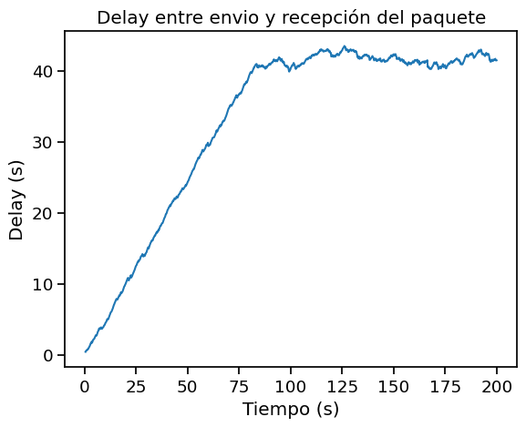   | 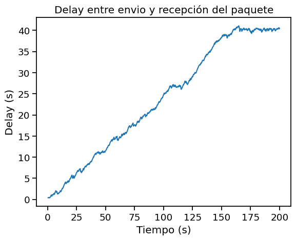   | 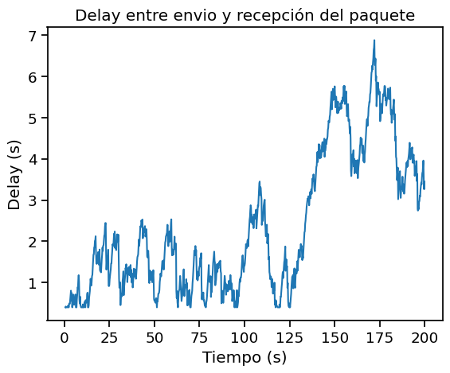   |
| 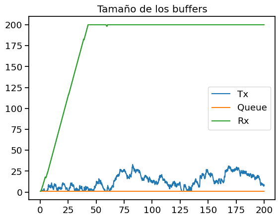   | 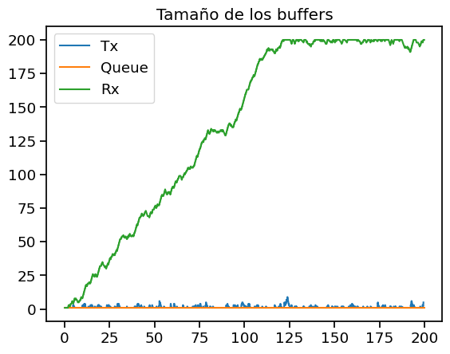   | 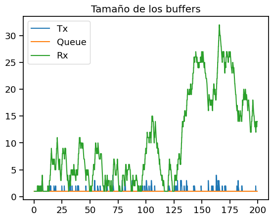   |
| 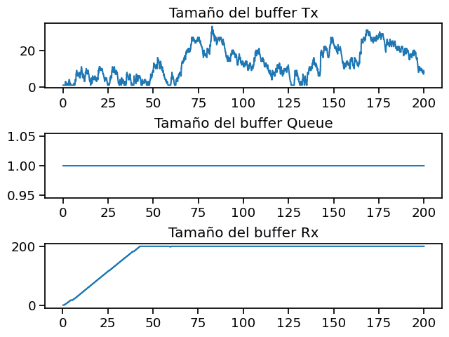   | 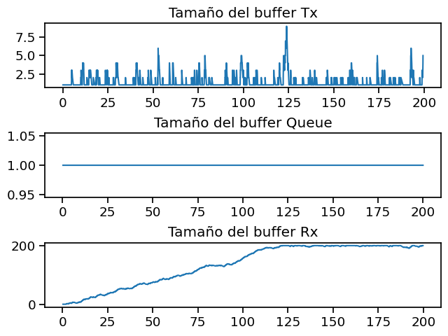   |    |

Como se puede ver en los gráficos y en la tabla anterior, mientras menor cantidad de paquetes se genera por segundo (mayor intervalo de generación de paquetes), menor es el delay promedio y menor es la cantidad de paquetes dropeados/perdidos. Esto se debe a que al haber menos paquetes en la red, le da tiempo suficiente al receptor para procesarlos sin que se llene su buffer. Un intervalo de generación de paquetes menor a 0.15 genera perdida de paquetes y bastante demora en la entrega de los paquetes, mientras que un intervalo de generación de paquetes mayor a 0.2 genera una entrega de paquetes rápida y sin perdida de paquetes, aunque la cantidad total de paquetes que se reciben será menor a la anterior.

En los gráficos de tamaño de los buffers podemos ver porque este caso es el relacionado al control de flujo, ya que el buffer del receptor es el que se llena primero, generando el cuello de botella explicado en la introducción. Es más. se puede ver una clara relación entre la demora en entregar el paquete y el tamaño del buffer del receptor en los 3 casos que se analizaron, luego de que el buffer del receptor se llena, la demora en entregar los paquetes aumenta considerablemente.

Tanto con el intervalo de generación de paquetes de 0.1 como con el de 0.15, el buffer del receptor se llena y una vez lleno se mantiene en ese estado hasta que la simulación termina. En el caso de 0.1, el buffer del receptor crece linealmente durante los primeros 35 segundos, que es cuando llega a su máximo tamaño, y luego se mantiene en ese valor hasta que la simulación termina. Podemos ver que la demora de los paquetes también crece linealmente hasta estabilizarse en un valor un poco superior a 40s (de demora en procesar el paquete), que supongo que es lo que debe esperar el paquete numero 200 en que se procesen los anteriores 199 paquetes.

Sin embargo con el intervalo de generación de paquetes de 0.2, el buffer del receptor no llega a llenarse y como máximo alcanza a tener unos 30~35 paquetes almacenados en el buffer, lo cual es un valor aceptable.

Como en este caso la velocidad de transmisión entre la cola Tx y la cola intermedia es igual a la velocidad de transmisión entre la cola intermedia y el recolector, el buffer de la cola intermedia no se llena, ya que los paquetes que recibe los transmite a la misma velocidad que los recibe. Esto se puede ver en los gráficos de tamaño de los buffers, donde el buffer de la cola intermedia se mantiene en un valor constante.

Todos los paquetes perdidos son perdidos en el buffer del receptor, ya que es el único que se llena. Esto se puede ver en los gráficos de tamaño de los buffers, donde el buffer del receptor es el único que se llega a su limite y se mantiene en ese estado hasta que la simulación termina.

### Caso 2 - Problema de control de congestión

Para este caso se establecieron las siguientes tasas de transferencia:

- Entre la cola intermedia y la cola Rx: 0.5Mbps
- Entre la cola Tx y la cola intermedia: 1Mbps
- Entre la cola Rx y el recolector: 1Mbps

Esta claro que la cola intermedia es el cuello de botella de la red, ya que es la que tiene la menor tasa de transferencia y recibirá paquetes a una velocidad mayor a la que puede procesarlos.

Se realizaron pruebas variando entre los siguientes intervalos de generación de paquetes: 0.1, 0.15 y 0.2.

Se obtuvieron los siguientes resultados:

| Intervalo de generación de paquetes | Paquetes enviados | Paquetes recibidos | Paquetes perdidos | Delay promedio |
|-------------------------------------|-------------------|--------------------|-------------------|----------------|
| 0.1                                 | 1979              | 998               | 771                 | 32.879 s        |
| 0.15                                | 1307              | 998               | 108                 | 23.628 s         |
| 0.2                                 | 989               | 976                | 0                 | 2.399 s         |

*Puede llamar un poco la atención que la suma entre la cantidad de paquetes recibidos y la cantidad de paquetes perdidos es menor a la cantidad de paquetes enviados. Esto se debe a que al finalizar la simulación, los paquetes que no llegaron a destino por estar almacenados en un buffer intermedio (o estarse transmitiendo en ese momento) no son contabilizados ni como paquetes dropeados ni como paquetes recibidos.*

A continuación gráficos que representan el comportamiento de la red variando el intervalo de generación de paquetes:

| 0.1 | 0.15 | 0.2 |
|-----|-----|-----|
|    |    |    |
| 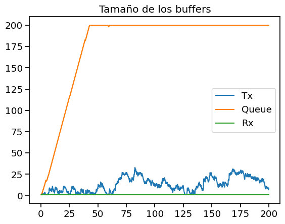   | 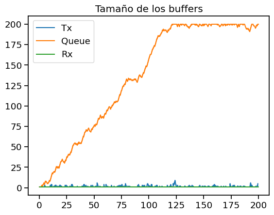   | 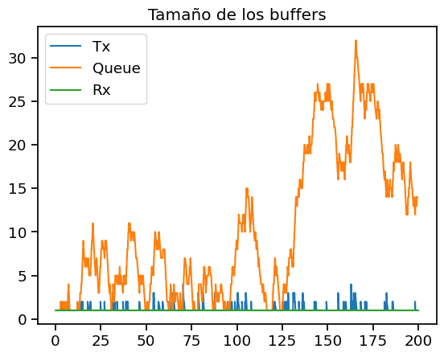   |
| 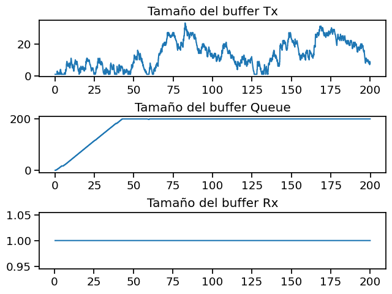   | 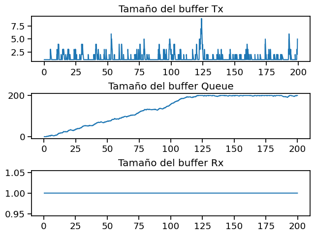   | 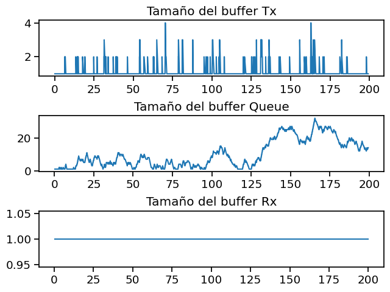   |

Como se puede ver los resultados obtenidos en el caso 2 son muy similares a los del caso 1, la única diferencia entre ambos es cual es la cola que se satura y genera el cuello de botella, que en este caso es la cola intermedia y por eso hablamos de control de congestión.

Todos los paquetes perdidos son perdidos en el buffer intermedio, ya que es el único que se llena. Esto se puede ver en los gráficos de tamaño de los buffers, donde el buffer intermedio es el único que se llena y se mantiene en ese estado hasta que la simulación termina.

No hay mucho más que agregar ya que los resultados son muy similares a los del caso 1, por lo que las conclusiones son las mismas.

### Comparación de los casos 1 y 2

La única diferencia observable entre los casos 1 y 2 es cual es la cola que se satura. La limitación en el caso 1 es la cola Rx y en el caso 2 es la cola intermedia. Además de ese aspecto, los resultados de ambos casos son muy similares, por no decir identicos, por lo que podriamos concluir que aunque el control de flujo y el control de congestión son dos problemas distintos, en este caso generan el mismo efecto en la red, que es una perdida de paquetes y un aumento en el delay de los paquetes que llegan a destino.

## Métodos

El algoritmo que proponemos para resolver ambos problemas es el siguiente:

Cuando algún nodo de la red (el queue intermedio o el queue Rx) detecta que su buffer está cerca de llenarse, envía un aviso al nodo emisor (en este caso el queue Tx) para que disminuya la tasa de transferencia de paquetes. El nodo emisor recibe el aviso y disminuye la tasa de transferencia de paquetes a la mitad. Cuando el nodo que envió el aviso detecta que su buffer está en un nivel aceptable, envía un aviso al nodo emisor para que aumente la tasa de transferencia de paquetes nuevamente. El nodo emisor recibe el aviso y aumenta la tasa de transferencia de paquetes al doble. Este proceso se repite hasta que la simulación finaliza.

Suponemos que el nodo emisor tiene un buffer infinito (o muy grande), por lo que no se puede llenar. Por lo tanto, el nodo emisor no envía avisos a ningún otro nodo de la red.

Esperamos que con este algoritmo se resuelvan los problemas de control de flujo y de control de congestión, ya que al disminuir la tasa de transferencia de paquetes cuando el buffer está cerca de llenarse, se evita que se llene y se generen perdidas de paquetes. Por eso queremos generar un canal de feedback y una comunicación correcta que permita que los nodos se avisen entre si cuando se necesita subir o bajar la tasa de transferencia.

Para que esta solución pueda llevarse a cabo, ese necesario un canal de feedback entre los nodos de la red. Por ello la estructura de la red se vio modificada y quedo de la siguiente manera:

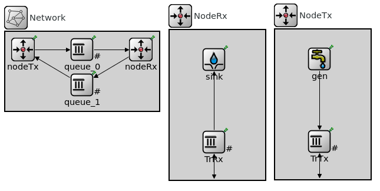

### Implementación

Para poder implementar el algoritmo propuesto, además de la modificación general de la estructura recientemente mostrada, se tuvieron que realizar las siguientes modificaciones:
- En las colas queue_0 y la cola TrRx se agregó un campo de tipo bool que informa si se envio un aviso al nodo emisor para que disminuya la tasa de transferencia de paquetes.
- Se estableció el umbral máximo al 80% para enviar el aviso de disminuir la tasa de transmisión al nodo emisor.
- Se estableció el umbral mínimo al 25% para enviar el aviso de aumentar la tasa de transmisión al nodo emisor.
- Se utiliza la función `setKind` para modificar el tipo de paquete que se envía al nodo emisor, de esta manera el nodo emisor sabe si debe aumentar o disminuir la tasa de transferencia de paquetes. En esta implementación los paquetes de tipo 2 son los que indican que se debe disminuir la tasa de transferencia de paquetes y los paquetes de tipo 3 son los que indican que se debe aumentar la tasa de transferencia de paquetes.
- Se modificó el método `handleMessage` de los nodos queue_0 y TrRx para que envíen el aviso al nodo emisor cuando corresponda.
- Como el nodo queue_0 no tiene un canal de feedback con el nodo emisor, el aviso se envia al nodo TrRx, que es el que tiene el canal de feedback con el nodo emisor. Cuando el nodo TrRx recibe un paquete de tipo 2 o tipo 3 lo envía al nodo emisor mediante el canal de feedback que utiliza a la queue_1. Luego el nodo emisor recibe el paquete y aumenta o disminuye la tasa de transferencia de paquetes según corresponda.

## Resultados

### Caso 1 - Control de flujo

Se usaron los mismos parametros que en el caso 1 de la parte 1 y los resultados obtenidos fueron los siguientes:

| Intervalo de generación de paquetes | Paquetes enviados | Paquetes recibidos | Paquetes perdidos | Delay promedio |
|-------------------------------------|-------------------|--------------------|-------------------|----------------|
| 0.1                                 | 1979              | 998               | 0                 | 49.742 s        |
| 0.15                                | 1307              | 998               | 0                 | 24.595 s         |
| 0.2                                 | 989               | 976                | 0                 | 2.399 s         |

*Puede llamar un poco la atención que la suma entre la cantidad de paquetes recibidos y la cantidad de paquetes perdidos es menor a la cantidad de paquetes enviados. Esto se debe a que al finalizar la simulación, los paquetes que no llegaron a destino por estar almacenados en un buffer intermedio (o estarse transmitiendo en ese momento) no son contabilizados ni como paquetes dropeados ni como paquetes recibidos.*

| 0.1 | 0.15 | 0.2 |
| --- | --- | --- |
| 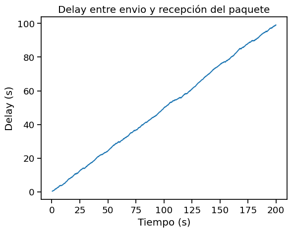 | 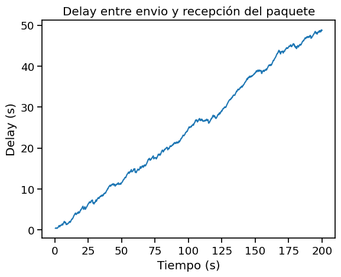 |  |
| 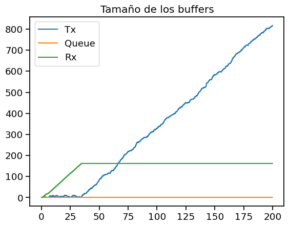 | 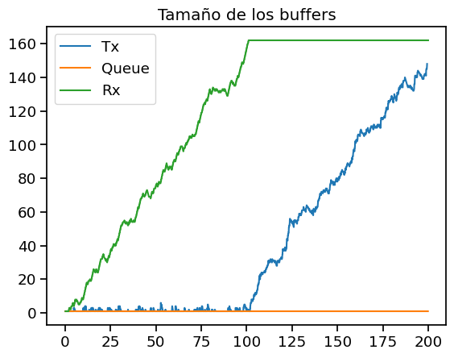 |  |
| 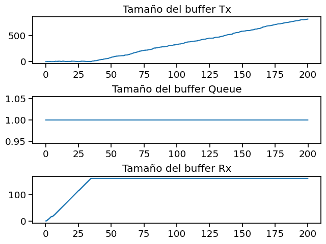 | 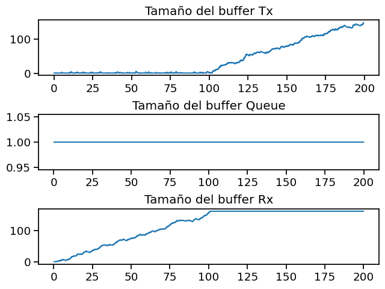 | 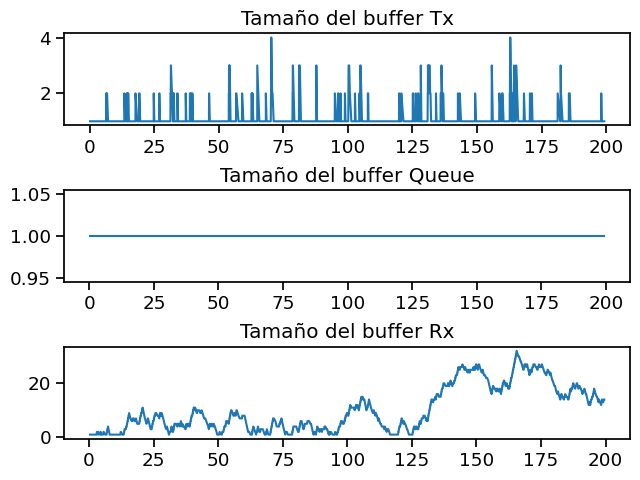 |

Como se pueden ver en los cuadros anteriores, los resultados obtenidos son similares a los obtenidos en la parte 1 cuando el intervalo de generación de paquetes es de 0.2 segundos, mientras que la mayor diferencia se observa cuando el intervalo de generación de paquetes es de 0.1 segundos. Esto se debe a que mientras más paquetes se envian por segundo, más rápido se llena el buffer y más necesario es el algoritmo de control de flujo para evitar la perdida de paquetes.

La cantidad de paquetes recibida y enviada es la misma que en la parte 1, ya que el control de flujo por como lo implementamos no afecta a la cantidad de paquetes enviados ni recibidos, sino que afecta a la cantidad de paquetes perdidos.

El algoritmo en este escenario funciona correctamente, ya que se evita por completo la perdida de paquetes. La desventaja es que para mantener el buffer de la cola Rx con una cantidad de paquetes aceptable, se debe disminuir la tasa de transferencia de paquetes, lo que aumenta la cantidad de paquetes en el buffer de la cola Tx. Esto se puede ver en los gráficos de la cantidad de paquetes en los buffers, por ejemplo, centrandonos en el caso en el que el intervalo de generación de paquetes es de 0.1 segundos, se puede ver que cuando el buffer de la cola Rx llega al 80% luego se mantiene estable hasta terminar la simulación, pero comienza a aumentar el tamaño del buffer de Tx de manera lineal. Ese aumento del tamaño del buffer comienza cuando el emisor recibe el pedido de feedback de bajar la tasa de transmisión, y se acumulan los paquetes porque se disminuye la tasa de transferencia a la mitad.

Otro valor que parece empeorar con el control de flujo es el delay promedio, pero esto se debe a que el delay promedio se calcula como el promedio de los delays de los paquetes que llegaron a destino. Como en este caso no se perdieron paquetes, el delay promedio aumenta ya que se tienen en cuenta los paquetes que estuvieron almacenados en el buffer de la cola Tx, los cuales sin el algoritmo de control de flujo probablemente se hubieran perdido y entonces su tiempo de delay no se hubiera tenido en cuenta.

### Caso 2 - Control de congestión

Se usaron los mismos parametros que en el caso 2 de la parte 1 y los resultados obtenidos fueron los siguientes:

| Intervalo de generación de paquetes | Paquetes enviados | Paquetes recibidos | Paquetes perdidos | Delay promedio |
|-------------------------------------|-------------------|--------------------|-------------------|----------------|
| 0.1                                 | 1979              | 998               | 0                 | 49.742 s        |
| 0.15                                | 1307              | 998               | 0                 | 24.596 s         |
| 0.2                                 | 989               | 976                | 0                 | 2.399 s         |

*Puede llamar un poco la atención que la suma entre la cantidad de paquetes recibidos y la cantidad de paquetes perdidos es menor a la cantidad de paquetes enviados. Esto se debe a que al finalizar la simulación, los paquetes que no llegaron a destino por estar almacenados en un buffer intermedio (o estarse transmitiendo en ese momento) no son contabilizados ni como paquetes dropeados ni como paquetes recibidos.*

| 0.1 | 0.15 | 0.2 |
| --- | --- | --- |
|  |  |  |
| 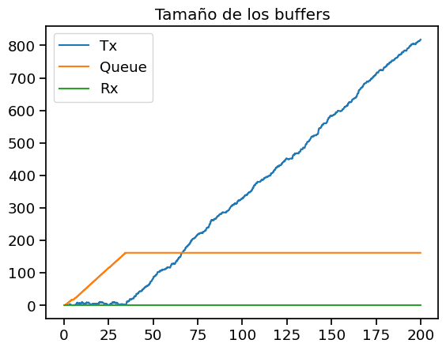 | 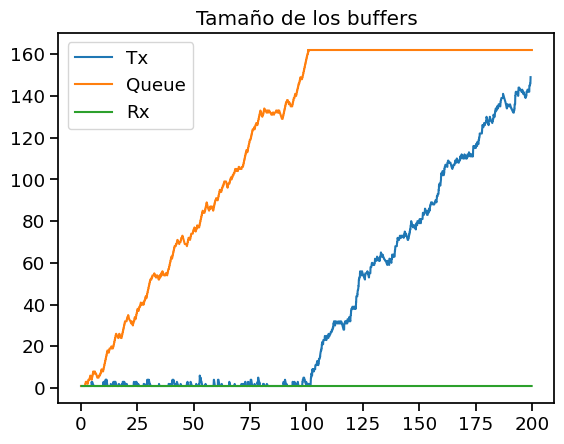 |  |
| 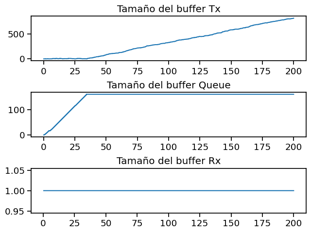 | 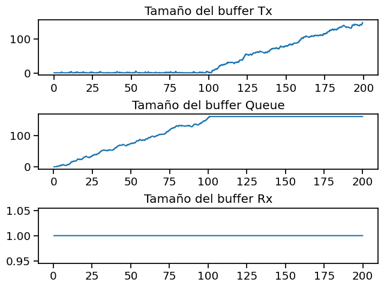 |  |

Como sucedió en la parte 1, los resultados de este caso 2 son muy similares a los obtenidos en el caso 1. La única diferencia sustancial entre ambos casos es cual es la cola que esta cerca de saturarse, que en este caso sería la cola intermedia, mientras que en el caso 1 era la cola Rx.

Para el control de congestión el algoritmo utilizado también funciona correctamente, ya que se evita por completo la perdida de paquetes. La desventaja es que para mantener el buffer de la cola intermedia con una cantidad de paquetes aceptable, se debe disminuir la tasa de transferencia de paquetes, lo que aumenta la cantidad de paquetes en el buffer de la cola Tx. (Análisis similar al caso 1)

El algoritmo funciona de manera similar en ambos casos porque aunque sean diferentes las colas que se saturan, en ambos casos se disminuye la tasa de transferencia de paquetes a la mitad para evitar la saturación de la cola que corresponda, además de que se usan los mismos parametros para ambos casos (0.5Mbps para la cola que debe saturarse y 1Mbps para las otras cola). Consideramos que tiene sentido y es correcto que el algoritmo funcione de manera similar en ambos casos, aunque no significa que se vaya a comportar igual si se cambian los parámetros a unos que sean menos simétricos.

### Caso 3 - Control de flujo y control de congestión (Extra)

Este tercer caso es un caso combinado que se nos ocurrió para analizar el funcionamiento del algoritmo cuando tenemos ambos problemas en simultaneo (control de flujo y control de congestión). Se modificaron los siguientes parametros:
- Intervalo de generación de paquetes: 0.1 segundos
- Tasa de transmisión entre la cola Tx y la cola intermedia: 1Mbps
- Tasa de transmisión entre la cola intermedia y la cola Rx: 0.75Mbps
- Tasa de transmisión entre la cola Rx y el resumidero: 0.5Mbps
- Capacidad del buffer de la cola intermedia: 100 paquetes

El único resultado obtenido diferente a los anteriores fue el tamaño de los buffers (ya que cantidad de paquetes enviados y recibidos fueron los mismos, y no hubo paquetes perdidos) así que nos centraremos en esos resultados:

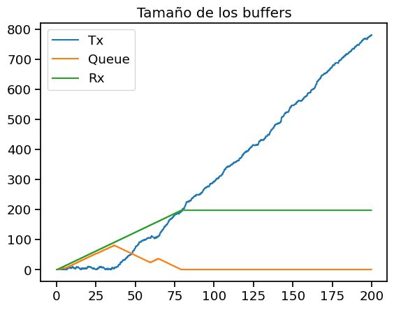
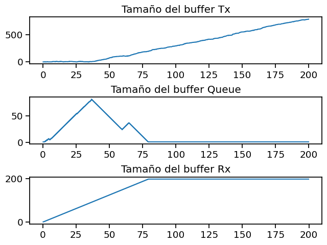

Como se puede ver, hubo un movimiento mucho más interesante en el tamaño de las colas durante la ejecución de la simulación.

Al comienzo tanto la cola Rx como la intermedia estaban llenando sus buffers de manera pareja, hasta que la cola intermedia alcanza el 80% de su capacidad. En ese momento, aproximadamente a los 40s de la simulación, es cuando se envia el mensaje de congestión y se disminuye la tasa de transferencia de paquetes. Esto hace que la cola intermedia pueda vaciarse (porque procesa los paquetes más rápido de lo que llegan) pero la cola Rx no, por lo que su buffer sigue llenandose. Cuando la cola intermedia se vacia, se vuelve a aumentar la tasa de transferencia de paquetes y se puede ver el mínimo local a los 60s de la simulación, en ese momento fue cuando se envio el mensaje al receptor de que retome el envio de paquetes con normalidad. Pero no pasaron muchos segundos hasta que la cola Rx llegó al 80% de su capacidad y se volvió a enviar el mensaje para bajar la tasa de transferencia, aunque esta vez por control de flujo. Una vez que se vacia la cola intermedia, como la tasa de transferencia de Tx es el doble que la tasa de transferencia de Rx, el tamaño del buffer de Tx se mantiene estable hasta terminar la simulación, ya que se vacia a la misma velocidad que se llena (Porque el Tx envia a la mitad de su tasa original).

### Gráficos de análisis de todos los resultados en conjunto

A continuación se muestra el gráfico de carga ofrecida vs carga útil:

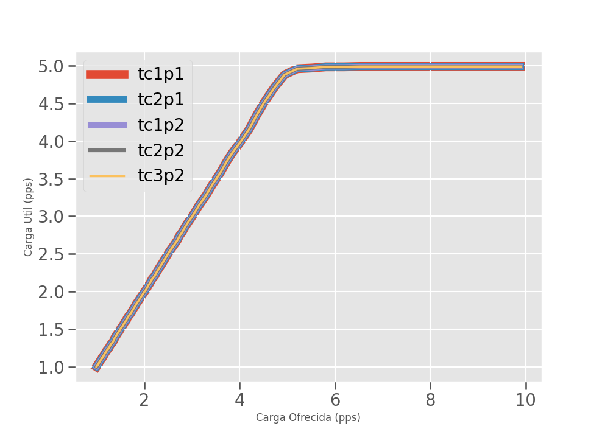

La carga ofrecida es la cantidad de paquetes que se generan por segundo, mientras que la carga útil es la cantidad de paquetes que llegan a destino por segundo. Como se puede ver, la carga útil es menor a la carga ofrecida, esto se debe a que los paquetes que se generan en la fuente no llegan a destino por diferentes motivos (se pierden en el camino, se almacenan en un buffer, etc).

Nos parece un poco raro que los 5 casos que utilizamos para la simulación tengan la misma carga útil, pero creemos que esto se debe a que tanto en la red básica como en la red que utiliza nuestro algoritmo siempre se genera la máxima cantidad de paquetes por segundo y se reciben la máxima cantidad de paquetes por segundo, por lo que la carga útil es la misma en todos los casos. La diferencia entre los casos es que en la red básica se pierden paquetes, mientras que en la red que utiliza nuestro algoritmo se almacenan en el buffer de Tx, pero en ninguno de los 2 casos durante la simulación de los 200s esos paquetes logran llegar al resumidero.

A continuación se muestra el gráfico de demora de procesamiento promedio de los paquetes:

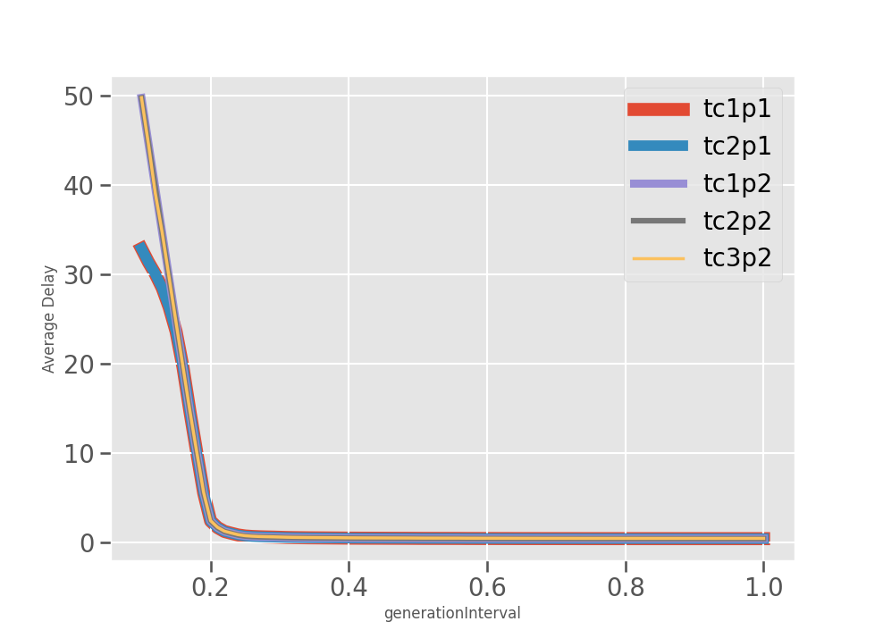

Como se puede ver, la demora de procesamiento promedio de los paquetes es muy similar como nos pasó en el gráfico anterior. Se presenta una leve diferencia entre la demora de procesamiento de los paquetes en la red básica y la red que utiliza nuestro algoritmo cuando el intervalo de generación de paquetes esta entre 0.1 y 0.2, pero ya explicamos anteriormente porque aumenta el valor en la red que utiliza nuestro algoritmo.

Este gráfico nos muestra cual es el valor de generation interval que nos permite tener la menor demora de procesamiento promedio de los paquetes, maximizando la cantidad de paquetes enviados y recibidos. En este caso, el valor óptimo es muy cercano a 0.2, ya que en ese punto se genera un quiebre en la curva. Si probamos casos más chicos que 0.2 (por ejemplo 0.15) la demora de procesamiento promedio de los paquetes aumenta considerablemente, mientras que si probamos casos más grandes que 0.2 (por ejemplo 0.25) la demora de procesamiento promedio de los paquetes disminuye un poquito pero no lo suficiente como para que valga la pena aumentar el intervalo de generación de paquetes, ya que se enviarán menos paquetes por segundo y no queremos eso.

## Discusión
Con este proyecto pudimos ver como se comportan los protocolos de control de flujo y control de congestión en una red de computadoras y cuales son las principales diferencias entre ambos problemas.

También pudimos implementar un algoritmo sencillo pero funcional para resolver ambos problemas en simultaneo, aunque con la desventaja de que se llena el buffer de la cola Tx más rápidamente, aunque esto es algo propio del diseño de red que estamos utilizando.

Creemos que el protocolo no se comporta de manera óptima y estamos seguros de que existen varios casos donde el protocolo no evita de manera total la perdida de paquetes, pero creemos que lo que hicimos es un buen punto de partida para seguir mejorandolo en el futuro, además de que los resultados obtenidos en los casos de prueba son muy buenos, lo que ahora nos queda por hacer es encontrar aquellos casos donde el protocolo no funciona correctamente y a partir de ahí seguir mejorandolo.

## Referencias
- Contenido audiovisual (videos/filminas) provisto por la catedra
- [Manual de OMNeT++](https://doc.omnetpp.org/omnetpp/manual/)
- Redes de Computadoras - Libro de Andrew S. Tanenbaum (5ta edición)

