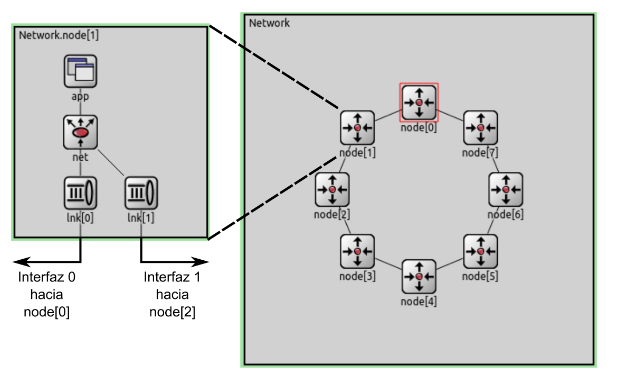
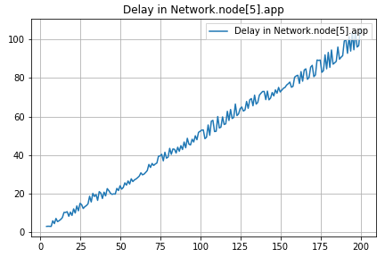

# Análisis y comparación de estrategias para el enrutamiento de una red con cierta topologia particular

## Resumen 
En este informe se va a analizar y comparar un algoritmo de enrutamiento para las redes de topologia tipo anillo, con la posibilidad de extender el algoritmo a topologías más generales.

El algoritmo que implementamos lo llamamos **"Falso Dijkstra"**. Te preguntarás por que el nombre y es porque internamente en cada nodo la topologia de la red se representa como un grafo donde todos caminos son de peso 1. En lugar de utilizar el algoritmo de Dijkstra para calcular las distancias mínimas entre dos nodos, se utiliza el algoritmo de BFS (Breadth-First Search). Los resultados obtenidos muestran un buen desempeño, aumentando la eficiencia de la red y la cantidad de paquetes entregados en comparación con el algoritmo inicial.

## Introducción

### Estrategias de enrutamiento

El enrutamiento en redes de computadoras es un problema que se presenta en la capa de red del modelo OSI o TCP/IP. El objetivo es encontrar la ruta más eficiente para enviar paquetes de datos desde el origen al destino. Esto es importante para optimizar el rendimiento de la red y minimizar la cantidad de paquetes demorados o perdidos. 

Existen diferentes estrategias para resolver este problema, cada una con sus propias ventajas y desventajas. En este informe, se analizará el rendimiento de un algoritmo de enrutamiento en particular, comparándolo con el algoritmo inicial dado por la catedra.

### Metodología de trabajo
Para analizar el comportamiento de la red con el algoritmo y sin el mismo, al igual que en el lab 3 utilizaremos **simulación discreta**.

En la **simulación discreta** es una técnica de simulación la cual en lugar de considerar el tiempo de manera continua, se divide en pasos o intervalos discretos. Cada uno de estos intervalos representa un punto en el tiempo en el que se realiza una actualización en el estado del sistema que se está simulando.

Esta técnica de modelado es especialmente útil cuando se trabaja con sistemas dinámicos complejos, ya que permite simular su comportamiento de manera más manejable y comprensible. Al dividir el tiempo en pasos discretos, se simplifica el proceso de cálculo y se facilita el seguimiento y análisis de los cambios en el estado del sistema en diferentes puntos en el tiempo.

Las simulaciones se llevan a cabo en una computadora utilizando **Omnet++**, un **entorno de simulación de eventos discretos**. En este entorno, se crea un modelo que representa una red simplificada y su comportamiento. El objetivo es analizar cómo funciona la red en diferentes escenarios, tanto con como sin la estrategia de enrutamiento implementada.

**Omnet++** es una herramienta poderosa que permite realizar estas simulaciones y analizar los resultados obtenidos. Proporciona un entorno flexible y configurable para modelar diferentes aspectos de la red y realizar experimentos virtuales. Esto ayuda a comprender cómo se comporta la red en diferentes situaciones y a evaluar la eficacia de los algoritmos en la optimización del rendimiento de la red.

La ventaja de utilizar simulación discreta es que se puede simular el comportamiento de la red en un tiempo _mucho menor_ al que se tardaría en realizar pruebas en una red real, y se puede analizar el comportamiento de la red en situaciones que serían _muy difíciles_ de simular en una red real. Por esa razón este estilo de simulación es una herramienta muy útil para analizar el comportamiento de una red.

### Análisis de los experimentos
Evaluaremos el funcionamiento de la estrategia de enrutamiento mediante dos casos de prueba.

- **Caso 1:** Se envian paquetes de manera regular desde dos nodos (El nodo 0 y el nodo 2) hacia un mismo nodo (El nodo 5).
- **Caso 2:** Se envian paquetes de manera regular desde todos los nodos (Excepto el nodo 5) hacia un mismo nodo (El nodo 5).

#### Estructura de la red

La red que se utiliza para realizar las simulaciones es una red de topología tipo anillo. 

En esta red internamente cada nodo cuenta con una capa de aplicación (app) que implementa un generador de tráfico y se encarga de generar y recibir los paquetes, una capa de red (net) que se encarga de el enrutamiento de los paquetes y dos capas de enlace (lnk) que se encargan de enviar los paquetes a los vecinos e implementa un buffer para almacenar los paquetes hasta poder ser enviados. Entonces cada nodo está conectado a dos vecinos, uno a la izquierda y otro a la derecha. Se puede ver la estructura de la red sintetizada en la siguiente imagen:

Cada paquete que la capa de red recibe es evaluado para determinar si el nodo local es el destino final del mismo. En caso de que lo sea, el paquete es enviado a la capa de aplicación local. En caso de que el paquete esté destinado a otro nodo se elige una interface para re-transmitirlo. 

En la implementación dada por la catedra la capa de red elige siempre mandar el paquete por la interfaz 0 (toLnk[0]) que es la que envía el tráfico en sentido de las manecillas del reloj a lo largo del anillo hasta llegar al destino. No se toman decisiones basadas en la eficiencia o la minimización de la ruta y se envian los paquetes de esa manera predeterminada, por lo que se puede esperar que el rendimiento de la red usando esa estrategia no sea óptimo.

El tamaño de los paquetes en todos los casos de prueba será de 125000 bytes, la tasa de transferencia de todos los enlaces es de 1Mbps, su retardo es de 0,1ms y el tiempo de simulación será de 200 segundos.

Se modificó la capa de app dada en el kickstarter para permitir la medición de estadisticas de la red, como paquetes enviados, paquetes recibidos, demora en la entrega de paquetes, cantidad de saltos, utilización de los buffers, etc. Luego de cada simulación se accede a estas estadisticas y se las utiliza para generar los gráficos y tablas que se presentan en este informe y permiten analizar el rendimiento de la red.

También se tuvo que modificar la estructura del paquete para integrar un campo con la cantidad de saltos que el paquete lleva realizados.

#### Caso 1

En este caso de prueba se envian paquetes de manera regular desde dos nodos (El nodo 0 y el nodo 2) hacia un mismo nodo (El nodo 5). Se obtuvieron los siguientes resultados con el interArrivalTime en exponential(1) segundos:

| Paquetes enviados | Paquetes recibidos | Demora promedio | Cantidad de saltos promedio |
| :---------------: | :----------------: | :-------------: | :-------------------------: |
|        390        |         196        |     51.159      |             3.918             |

| Demora en recibir un paquete | 
| :-------------------------: | 
|  | 
| En el eje x se puede ver el tiempo de la simulación en segundos y en el eje y se puede ver la demora en recibir un paquete en segundos.|

|Utilización de los buffers (todos) | 
|:------------------------------------: |
| |
| En el eje x se puede ver el tiempo de la simulación en segundos y en el eje y se puede ver la cantidad de paquetes en el buffer.|○

| Utilización de los buffers (individual) |
| :---------------------------------: |
|  |
| En el eje x se puede ver el tiempo de la simulación en segundos y en el eje y se puede ver la cantidad de paquetes en el buffer para cada buffer |

Como primer punto podemos observar que se recibieron en el nodo 5 más o menos la mitad de los paquetes enviados desde los nodos 0 y 2. Esto sucede porque en la configuración proporcionada no se elige la ruta óptima para enviar los paquetes desde el Nodo 2 hasta el Nodo 5. Entonces se genera un cuello de botella en el enlace que conecta el nodo 0 con el nodo 1 y los paquetes se acumulan en ese buffer, como podemos ver en los gráficos de la utilización de los buffers. Todos los demás buffers se mantienen en valores aceptables.

Al tener un cuello de botella y un crecimiento lineal del tamaño del buffer debido a que ambos nodos comparten una parte de su recorrido hasta el nodo 5, se genera un crecimiento lineal de la demora en recibir un paquete, como se puede ver en el gráfico de demora en recibir un paquete. Si se eligiera la ruta óptima para enviar los paquetes, la demora sería constante y mucho menor ya que los paquetes del nodo 0 y 2 utilizarían rutas distintas y no se acumularían en el mismo buffer.

Centrandonos un poco más en el cuello de botella, este surge porque el nodo 0 genera paquetes que estan listos para ser enviado y los cuales deben salir por la misma ruta para enviar los paquetes desde el nodo 2. A causa de lo anterior, el enlace que conecta el nodo 0 con el nodo 1 no maneje esta ola de paquetes proveniente del nodo 0, y esto provoca que se acumulen en el buffer. 

El nodo 2 también ve un crecimiento en el tamaño de su buffer en algunos momentos de la simulación, pero es debido a la aleatoriedad de la generación de paquetes, ya que luego del pico de crecimiento el buffer baja nuevamente a valores aceptables.○

#### Caso 2

En este caso de prueba se envian paquetes de manera regular desde los 7 nodos hacia el nodo 5. Se obtuvieron los siguientes resultados con el interArrivalTime en exponential(4) segundos:

Decidimos cambiar de exponential(1) a exponential(4) para poder ver mejor los resultados, ya que con exponential(1) los paquetes se generaban muy seguido y se generaba un embotellamiento en los buffers que tenia que ver con la topologia y generación de paquetes y no con la estrategia de enrutamiento.

| Paquetes enviados | Paquetes recibidos | Demora promedio | Cantidad de saltos promedio |
| :---------------: | :----------------: | :-------------: | :-------------------------: |
|        344        |         195        |     41.349      |             3.866             |

| Demora en recibir un paquete |
| :-------------------------: |
|  |
| En el eje x se puede ver el tiempo de la simulación en segundos y en el eje y se puede ver la demora en recibir un paquete en segundos. |

| Utilización de los buffers (todos) |
| :--------------------------------------: |
| |
| En el eje x se puede ver el tiempo de la simulación en segundos y en el eje y se puede ver la cantidad de paquetes en el buffer. |

| Utilización de los buffers (individual) |
| :---------------------------------: |
|  |
| En el eje x se puede ver el tiempo de la simulación en segundos y en el eje y se puede ver la cantidad de paquetes en el buffer para cada buffer |

Como podemos ver en los gráficos y la tabla de datos, en este caso también tenemos que llegaron a destino aproximadamente la mitad de los paquetes enviados. En este caso también sucede porque en la configuración proporcionada no se elige la ruta óptima para enviar los paquetes, lo que desencadena que en los nodos más cercanos al nodo 5 (yendo en el sentido horario) se acumulen paquetes en los buffers. Esto se puede ver en los gráficos de utilización de los buffers, donde se puede ver que los buffers de los nodos 6, 7, 0 y 1 se llenan de manera desproporcionada con respecto a los demás nodos y nunca se vacian durante el tiempo de simulación, presentan un crecimiento lineal en su tamaño.

Al igual que en el caso anterior, el cuello de botella se genera porque los nodos generan paquetes que deben pasar por el mismo enlace que se utiliza para enviar paquetes de los vecinos hacie el nodo 5, y este enlace no es capaz de manejar la cantidad de paquetes que quieren utilizarlo. Esto se puede ver en el gráfico de demora en enviar un paquete, donde se puede ver que la demora crece de manera lineal a medida que pasa el tiempo, acompañando el crecimiento en el tamaño de los buffers. Los picos descendentes en la demora se deben a paquetes de nodos cercanos al nodo 5 que estuvieron esperando en los buffers de menos cantidad de nodos y que llegaron "rapidamente" a su destino, a comparación de los paquetes más lejanos al nodo 5 que tuvieron que esperar en cada uno de los buffers saturados que se encontraron en su camino (Por ejemplo, paquetes del nodo 4 tuvieron que pasar por los buffers de los nodos 3,2,1,0,7,6 antes de llegar a su destino, y varios de esos se vieron saturados durante la simulación).

#### Conclusiones

El algoritmo utilizado es muy básico y no aprovecha eficientemente la estructura de la red. En lugar de utilizar ambas "direcciones/opciones" que brinda la red en topologia anillo, solo utiliza una de ellas, lo que desperdicia recursos y capacidad de transmisión. Además, en muchas ocasiones, el algoritmo elige la ruta más larga posible para llegar a un nodo, en lugar de optar por una ruta más corta y directa.

## Métodos

Para resolver el problema de enrutamiento proponemos un algoritmo que llamamos **"Falso Dijkstra"**, que funciona de la siguiente manera:

1. Al inicializar la red, cada nodo envia un paquete "Hello" a todas las interfaces que tiene disponibles. 
2. Cuando un nodo vecino recibe el paquete "Hello", le envia un paquete "HelloAck" al nodo que lo envio. El paquete "HelloAck" contiene el id del nodo que esta enviando el paquete.
3. Cuando un nodo recibe un paquete "HelloAck", guarda la información de que el nodo que envio el paquete es un vecino suyo.
4. Cuando un nodo recibe el nombre de todos sus vecinos, prepara un paquete especial llamado "Info" que contiene el id del nodo que lo envia y su lista de vecinos. Este paquete se envia a todos los nodos de la red mediante inundación.
5. Cuando un nodo recibió el paquete "Info" de todos los nodos de la red, calcula el camino mas corto hacia todos los nodos de la red utilizando el algoritmo BFS. 
6. Se rellena una tabla de enrutamiento con la información obtenida en el paso anterior.
7. Cuando un nodo recibe un paquete de datos, lo envia por la interfaz que corresponda según la tabla de enrutamiento.

Elegimos BFS frente a Dijkstra debido a que BFS permite computar distancias minimas en grafos no ponderados/con solo peso 1, y la topologia de la red se representa como un grafo donde todos caminos son de peso 1. Además la complejidad de Djkstra es O(n^2) y la de BFS es O(n+m) donde n es la cantidad de nodos y m la cantidad de aristas, dando que en grafos no densos (Como la topologia que presentan la mayoria de las redes) BFS es más eficiente. 

### Implementación

Para poder implementar el algoritmo propuesto se tuvo que modificar la capa de red (net) y la estructura del paquete.

En la estructura del paquete se agregó un campo que contiene una lista/vector de nodos. Este campo se utiliza para guardar la lista de vecinos de cada nodo en los paquetes de tipo "Info" que se envian durante el proceso de inicialización de la red.

En la capa de red hubo mushisimos cambios. Se agregaron los siguientes campos:
- `routingTable`: Una tabla/map de enrutamiento que contiene la información de que interfaz utilizar para llegar a cada nodo de la red.
- `graph`: Una estructura que representa el grafo de la red. Se utiliza para calcular el camino mas corto hacia todos los nodos de la red.
- `infoReceived`: Un map que se utiliza para saber cuando se recibió el paquete "Info" de todos los nodos de la red.
- `ready`: Un booleano que se utiliza para saber cuando el nodo esta listo para enviar paquetes de datos.
- `numInterfaces`: Un entero que se utiliza para saber cuantas interfaces (validas) tiene el nodo.
- `numNeighborsKnown`: Un entero que se utiliza para saber cuantos vecinos del nodo ya conocemos su id.
- `neighbors`: Un map que vincula el id de un nodo con su interfaz correspondiente. Se utiliza para saber que interfaz utilizar para enviar un paquete a un nodo vecino.

Se vincularon los siguientes "tipos" de paquetes al `Kind` del paquete:
- `Hello`: Kind 3
- `HelloAck`: Kind 4
- `Info`: Kind 5

El nuevo proceso de inicialización inicializa las variables necesarias y envia un paquete "Hello" por todas las interfaces validas.

Luego, las modificaciones en el metodo `handleMessage` son las siguientes:
- Si se recibe un paquete de tipo Hello se envia un paquete de tipo HelloAck por la interfaz correspondiente.
- Si se recibe un paquete de tipo HelloAck se guarda la información de que el nodo que envio el paquete es un vecino en el map `neighbors` y en el grafo, además de incrementar el contador `numNeighborsKnown` y establecer `infoReceived` en false para el nodo que envio el paquete.
  - Si `numNeighborsKnown` es igual a `numInterfaces` se envia un paquete "Info" con la lista de vecinos del nodo por todas las interfaces validas.
- Si se recibe un paquete de tipo Info y ya habiamos recibido un paquete de tipo Info del nodo que envio el paquete, es decir, su entrada en el map `infoReceived` es true, se ignora el paquete.
  - Si no se habia recibido un paquete de tipo Info del nodo que envio el paquete, se guarda la lista de vecinos del nodo en el grafo y se establece `infoReceived` en true para el nodo que envio el paquete y en false para todos los vecinos (del nodo que envio el paquete) que nosotros no conociamos hasta ahora. Luego se reenvia el paquete "Info" por todas las interfaces validas excepto la que recibimos el paquete (Para generar inundación).
  - Si luego de recibir un paquete de tipo Info se cumple que `infoReceived` es true para todos los nodos de la red, se calcula el camino mas corto hacia todos los nodos de la red utilizando BFS y se rellena la tabla de enrutamiento con la interfaz correspondiente para llegar a cada nodo.

Finalmente, si se recibe un paquete de tipo Data y `ready` es true, se envia el paquete por la interfaz correspondiente según la tabla de enrutamiento. Si `ready` es false, se ignora el paquete.

## Resultados

### Caso 1

En este caso de prueba se envian paquetes de manera regular desde dos nodos (El nodo 0 y el nodo 2) hacia un mismo nodo (El nodo 5). Se obtuvieron los siguientes resultados con el interArrivalTime en exponential(1) segundos:

| Paquetes enviados | Paquetes recibidos | Demora promedio | Cantidad de saltos promedio |
| :---------------: | :----------------: | :-------------: | :-------------------------: |
| 390 | 379 | 6.904 | 3.000 |

| Demora en recibir un paquete |
| :-------------------------: |
|  |
| En el eje x se puede ver el tiempo de la simulación en segundos y en el eje y se puede ver la demora en recibir un paquete en segundos. |

| Utilización de los buffers (todos) |
| :--------------------------------------: |
| |
| En el eje x se puede ver el tiempo de la simulación en segundos y en el eje y se puede ver la cantidad de paquetes en el buffer. |

| Utilización de los buffers (individual) |
| :---------------------------------: |
|  |
| En el eje x se puede ver el tiempo de la simulación en segundos y en el eje y se puede ver la cantidad de paquetes en el buffer para cada buffer |

En este caso se puede ver que el uso de la red fue mucho más eficiente, casi todos los paquetes llegaron a destino y la demora promedio fue mucho menor. Esto se debe a que el algoritmo de enrutamiento que implementamos funciona correctamente y logra brindarle a cada paquete la ruta más corta hacia su destino.

Como tanto el nodo 0 como el nodo 2 tienen que atravezar 2 nodo para llegar al nodo 5, la cantidad de saltos promedio es 3. Otro dato interesante para analizar es la demora en el tiempo, que tiene variaciones pero son propias de la aleatoriedad de la simulación en la generación de paquetes y no se ve una tendencia de crecimiento lineal como si se veía con la estrategia de enrutamiento anterior.

En el caso de los buffers los únicos buffers que no presentan un comportamiento constante son los de los nodos 0 y 2, que son los que envian los paquetes. Esto se debe a que los paquetes tienen un tiempo de generación aleatorio y por lo tanto puede en algunos momentos saturarse un poco el buffer, pero también tiene momentos donde se vacia y mantiene valores bajos por un tiempo. Lo importante es que aquí tampoco se ve una tendencia de crecimiento lineal como si se veía con la estrategia de enrutamiento anterior.

| Comparación delay promedio | Comparación cantidad de saltos promedio |
| :-------------------------: | :-------------------------: |
|  |  |

En estas dos gráficas se puede ver la comparación entre los resultados obtenidos con la estrategia de enrutamiento anterior y los resultados obtenidos con la nueva estrategia de enrutamiento en terminos de delay promedio y cantidad de saltos promedio. Se puede ver que con la nueva estrategia de enrutamiento se obtienen mejores resultados en ambos casos y que la diferencia es bastante grande sobre todo en el delay promedio, simbolizando una mejora en la eficiencia y el uso equilibrado de la red. Todo esto es gracias a que ahora cada paquete toma la ruta más corta hacia su destino.

Algo muy importante a destacar es que no se generan loops de enrutamiento en este caso con la estrategia de enrutamiento implementada.

### Caso 2

En este caso de prueba se envian paquetes de manera regular desde los 7 nodos hacia el nodo 5. Se obtuvieron los siguientes resultados con el interArrivalTime en exponential(4) segundos:

Decidimos cambiar de exponential(1) a exponential(4) para poder ver mejor los resultados, ya que con exponential(1) los paquetes se generaban muy seguido y se generaba un embotellamiento en los buffers que tenia que ver con la topologia y generación de paquetes y no con la estrategia de enrutamiento.

| Paquetes enviados | Paquetes recibidos | Demora promedio | Cantidad de saltos promedio |
| :---------------: | :----------------: | :-------------: | :-------------------------: |
| 344 | 333 | 4.694 |2.318 |

| Demora en recibir un paquete |
| :-------------------------: |
|  |
| En el eje x se puede ver el tiempo de la simulación en segundos y en el eje y se puede ver la demora en recibir un paquete en segundos. |

| Utilización de los buffers (todos) |
| :--------------------------------------: |
| |
| En el eje x se puede ver el tiempo de la simulación en segundos y en el eje y se puede ver la cantidad de paquetes en el buffer. |

| Utilización de los buffers (individual) |
| :---------------------------------: |
|  |
| En el eje x se puede ver el tiempo de la simulación en segundos y en el eje y se puede ver la cantidad de paquetes en el buffer para cada buffer |

Nuevamente podemos notar a partir de los gráficos y tablas que se hizo un mejor uso de la red, logrando que casi todos los paquetes lleguen a destino. La demora promedio también fue mucho menor que en el caso anterior, lo que se debe a que la estrategia de enrutamiento funciona correctamente y logra brindarle a cada paquete la ruta más corta hacia su destino.

Como se puede ver en el gráfico de demora en recibir un paquete, la demora es mucho menor que en el caso anterior y no se ve una tendencia de crecimiento lineal como si se veía con la estrategia de enrutamiento anterior. Los buffers se llenan un poco en algunos momentos de la simulación, sobre todo los buffers más cercanos al nodo 5, pero esto se debe a que los paquetes tienen un tiempo de generación aleatorio y por lo tanto puede en algunos momentos saturarse un poco el buffer, pero también tiene momentos donde se vacia y mantiene valores bajos por un tiempo. Lo importante es que aquí tampoco se ve una tendencia de crecimiento lineal como si se veía con la estrategia de enrutamiento anterior.

| Comparación delay promedio | Comparación cantidad de saltos promedio |
| :-------------------------: | :-------------------------: |
|  |  |

En estas dos gráficas se puede ver la comparación entre los resultados obtenidos con la estrategia de enrutamiento anterior y los resultados obtenidos con la nueva estrategia de enrutamiento en terminos de delay promedio y cantidad de saltos promedio. Se puede ver que con la nueva estrategia de enrutamiento se obtienen mejores resultados en ambos casos y que la diferencia es bastante grande sobre todo en el delay promedio, simbolizando una mejora en la eficiencia y el uso equilibrado de la red. Todo esto es gracias a que ahora cada paquete toma la ruta más corta hacia su destino.

Algo muy importante a destacar es que no se generan loops de enrutamiento en este caso con la estrategia de enrutamiento implementada.

#### Punto de equilibrio

| carga util/carga ofrecida en distintos InterArrivalTime |
| :--------------------------------------: |
| |
| En el eje x se puede ver el InterArrivalTime y en el eje y se puede ver la carga util/carga ofrecida. |

Como podemos observar en el gráfico, la primera estrategia de enrutamiento necesita aproximadamente el doble de InterArrivalTime para lograr la misma carga util/carga ofrecida que la nueva estrategia de enrutamiento. La estrategia que implementamos aproximadamente en un InterArrivalTime de 4 segundos logra una carga util/carga cercana a 1 y un equilibrio en la red, mientras que la estrategia anterior necesita un InterArrivalTime de aproximadamente 8 segundos para lograr una carga util/carga cercana a 1, lo que significa que la nueva estrategia de enrutamiento permite generar el doble de paquetes que la estrategia anterior sin que se sature la red y se pueda mantener el equilibrio de la misma.

### Caso 3 - Network Star (Punto estrella)

#### Topologia

La topología que se utilizó para este caso de prueba es la siguiente:

Como vemos es mucho más compleja que la topología del anillo, ya que tiene muchos más nodos y muchos más enlaces, y no tiene una cantidad fija de enlaces por nodo. En este caso de prueba nos centraremos en ver que la red se utiliza de manera eficiente y que la mayoría de los paquetes lleguen a destino.

En este caso de prueba se envian paquetes de manera regular desde los 7 nodos hacia el nodo 5 como en el caso 2. Se obtuvieron los siguientes resultados con el interArrivalTime en exponential(4) segundos:

| Paquetes enviados | Paquetes recibidos | Demora promedio | Cantidad de saltos promedio |
| :---------------: | :----------------: | :-------------: | :-------------------------: |
| 344 | 235 | 29.819 | 1.936 |

No tenemos mucho con lo que comparar debido a que el algoritmo de enrutamiento anterior no funciona en esta topología, se genera un error en la simulación. Igual es claro que el algoritmo anterior no serviría para esta topologia más complicada y habría gran cantidad de paquetes que no llegarían a destino.

La cantidad de paquetes recibidos es baja en relación a la cantidad de paquetes enviados, eso se debe sobre todo a que se genera un cuello de botella en el nodo 4, todos los nodos excepto el nodo 6 lo utilizan al nodo 4 en el camino para que sus paquetes lleguen al nodo 5, por lo que el nodo 4 se satura y no puede enviar todos los paquetes que recibe. Hablamos un poco más de este problema en la próxima sección, donde se analizan mejoras posibles al algoritmo de enrutamiento.

Sin embargo, fuera de ese pequeño detalle, el algoritmo se comporta de manera satisfactoria en la red, logrando que la mayoría de los paquetes lleguen a destino, logrando que utilicen los caminos más cortos para llegar a su destino.

## Discusión

El algoritmo implementado funciona correctamente tanto en redes con topologia anillo como en redes más complejas como la topologia del punto estrella. En ambos casos se logra un uso eficiente de la red y se logra que la mayoría de los paquetes lleguen a destino. Sin embargo, un problema importante que no contempla el algoritmo es que si se cae un nodo de la red, el algoritmo no lo detecta y sigue enviando paquetes a ese nodo, lo que genera que los paquetes se pierdan. Esto se debe a que el algoritmo solo se ejecuta al inicializar la red y mantiene la misma configuración en las tablas de enrutamiento de cada nodo durante toda la simulación. Para solucionar este problema se podría implementar un algoritmo que detecte cuando un nodo se cae y que vuelva a ejecutar el algoritmo de enrutamiento para que los paquetes tomen una ruta diferente y no se pierdan. Otra posible solución sería que el algoritmo de enrutamiento se ejecute cada cierto tiempo para que los paquetes tomen rutas diferentes y no se pierdan. Sin embargo, esto podría generar un problema de eficiencia en la red, ya que si se ejecuta el algoritmo de enrutamiento muy seguido se inundaría la red de paquetes de control/información y se perdería eficiencia. 

Otro problema que tiene la estrategia de enrutamiento planteada es que el "costo" de cada enlace es siempre 1, sin importar la distancia entre nodos o que tan congestionado esté el enlace. Esto puede generar que se saturen algunos enlaces y que otros enlaces no se usen, lo que no es eficiente. Para solucionar este problema se podría implementar un algoritmo que calcule el costo de cada enlace en base a la distancia entre nodos y a la cantidad de paquetes que se están enviando por ese enlace. De esta manera se podría lograr un uso más eficiente de la red.

Para llegar al funcianamiento correcto de nuestro algortimo de enrutamiento tuvimos que realizar una gran cantidad de iteraciones y correcciones sobre la idea original. Ademas encontramos que fue un desafío determinar qué interfaces (lnk) del nodo estaban conectadas con el exterior y cuáles no para el caso estrella. Nos llevó mucho tiempo y esfuerzo y tuvimos que probar diversas configuraciones hasta encontrar una solución que funcionara correctamente y no generara problemas.

Con esta actividad pudimos entender el funcionamiento de una red y como diseñar una estrategia de enrutamiento para mejorar el control y lograr un uso eficiente de la misma. Aprendimos bastante sobre el funcionamiento de las redes y estrategias de enrutamiento para poder lograr implementar nuestra propia estrategia de enrutamiento. 

## Referencias
- Contenido audiovisual (videos/filminas) provisto por la catedra
- [Manual de OMNeT++](https://doc.omnetpp.org/omnetpp/manual/)
- Redes de Computadoras - Libro de Andrew S. Tanenbaum (5ta edición)
