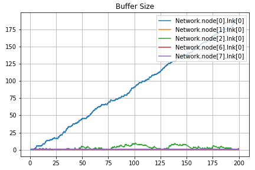
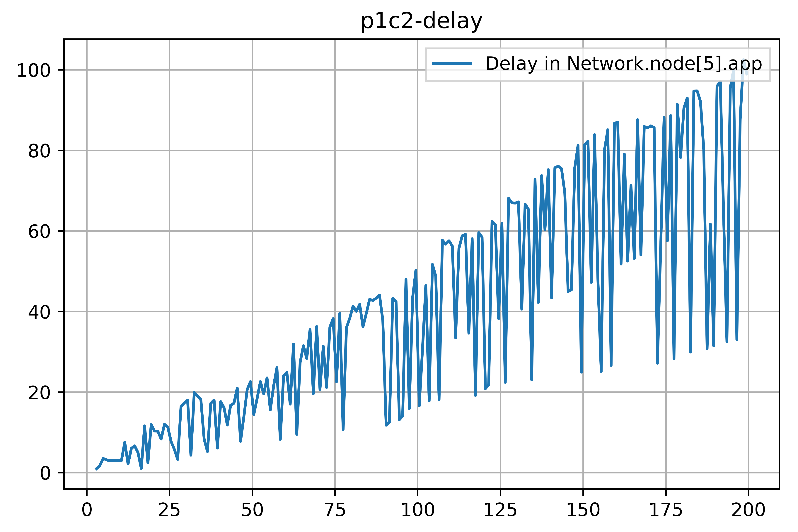
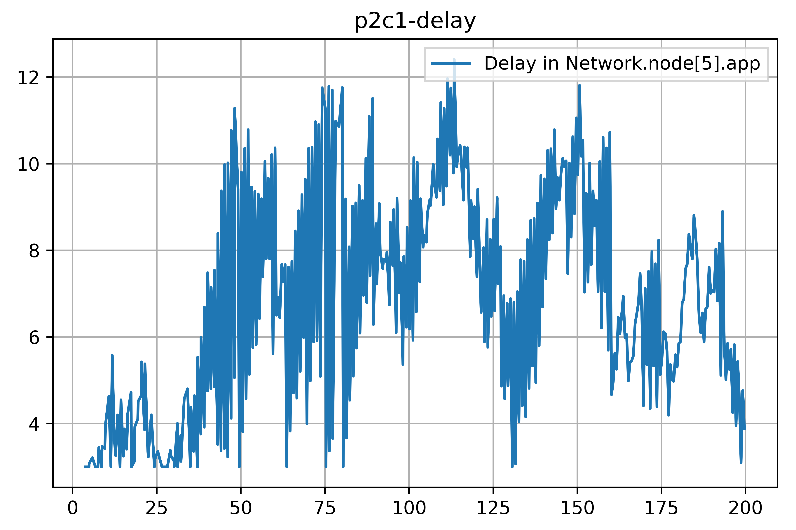
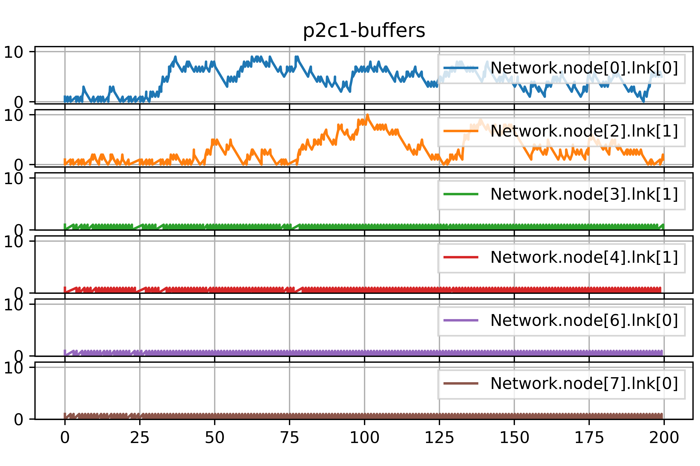
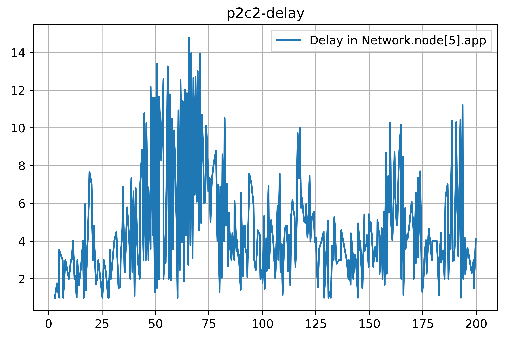
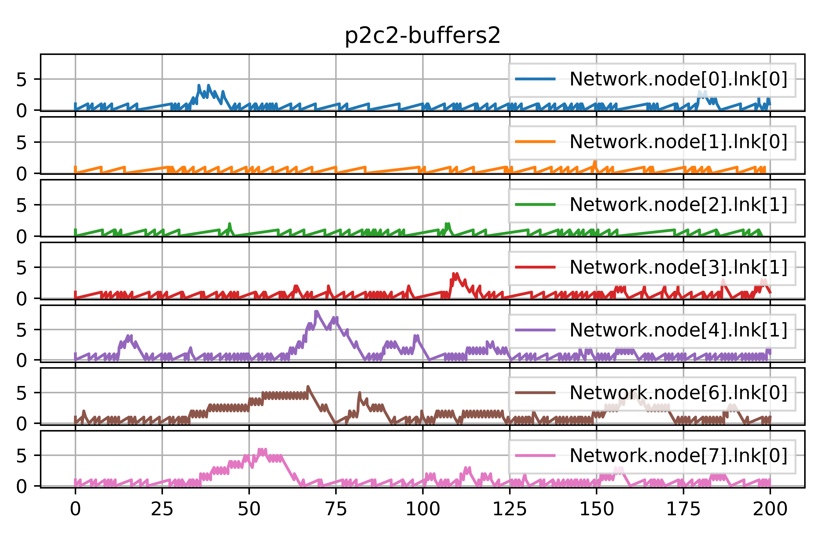

# Lab 4 - Capa de red

## Presentación problemas
### La capa de red

La capa de red tiene la responsabilidad de tomar los datos recibidos de la capa de transporte y dividirlos en paquetes o datagramas para su transmisión a través de la red. Además, se encarga de determinar la ruta más eficiente para enviar esos paquetes desde el origen hasta el destino final, teniendo en cuenta aspectos como la congestión de la red, el enrutamiento de los paquetes y la selección de los caminos óptimos.

### Enrutamiento en la capa de red

El enrutamiento en redes de computadoras es un problema que se presenta en la capa de red del modelo OSI o TCP/IP. El objetivo es encontrar la ruta más eficiente para enviar paquetes de datos desde el origen al destino. Esto es importante para optimizar el rendimiento de la red y minimizar la cantidad de paquetes demorados o perdidos.

### La estructura de la red

---

En esta red internamente cada nodo cuenta con una capa de aplicación (app) que implementa un generador de tráfico y se encarga de generar y recibir los paquetes, una capa de red (net) que se encarga de el enrutamiento de los paquetes y dos capas de enlace (lnk) que se encargan de enviar los paquetes a los vecinos e implementa un buffer para almacenar los paquetes hasta poder ser enviados

## Diagnostico
### Casos
#### Caso 1
Se envian paquetes de manera regular desde dos nodos (El nodo 0 y el nodo 2) hacia un mismo nodo (El nodo 5).
#### Caso 2
Se envian paquetes de manera regular desde todos los nodos (Excepto el nodo 5) hacia un mismo nodo (El nodo 5).

### Resultados
#### Caso 1

#### Caso 2

## Propuesta de solución

### Modificaciones de a la estructura de la red
las modificaciones se realizaron en el metodo handleMessage.
y a su vez en el archivo **packet.msg**
packet Packet {
    int source;
    int destination;
    int hopCount;
    int neighbours[];
}

### Algoritmo

El algoritmo que implementamos lo llamamos "Falso Dijkstra", pues internamente en cada nodo la topologia de la red se representa como un grafo donde todos caminos son de peso 1. En lugar de utilizar el algoritmo de Dijkstra para calcular las distancias mínimas entre dos nodos, se utiliza el algoritmo de BFS.

### Implementación
Se agregaron los siguientes campos:
- `routingTable`: Una tabla/map de enrutamiento.
- `graph`: Una estructura que representa el grafo de la red.
- `infoReceived`: Un map para saber cuando se recicio el paquete "info"
- `ready`: Un booleano que se utiliza para saber cuando el nodo esta listo para enviar paquetes de datos.
- `numInterfaces`: Un entero que se utiliza para saber cuantas interfaces (validas) tiene el nodo.
- `numNeighborsKnown`: Un entero que se utiliza para saber cuantos vecinos del nodo ya conocemos su id.
- `neighbors`: Un map que vincula el id de un nodo con su interfaz correspondiente.

---

Se vincularon los siguientes "tipos" de paquetes al `Kind` del paquete:
- `Hello`: Kind 3
- `HelloAck`: Kind 4
- `Info`: Kind 5

## Conclusiones y resultados de la solución
### Casos
#### Caso 1

#### Caso 2

#### Equilibrio

### Network Star

### Discusión

Con esta actividad pudimos entender el funcionamiento de una red y como diseñar una estrategia de enrutamiento para mejorar el control y lograr un uso eficiente de la misma. Aprendimos bastante sobre el funcionamiento de las redes y estrategias de enrutamiento para poder lograr implementar nuestra propia estrategia de enrutamiento. 
